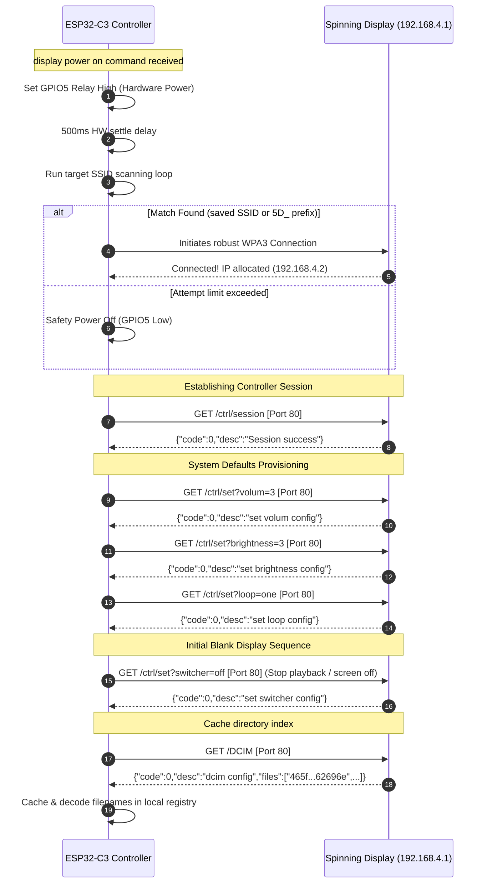
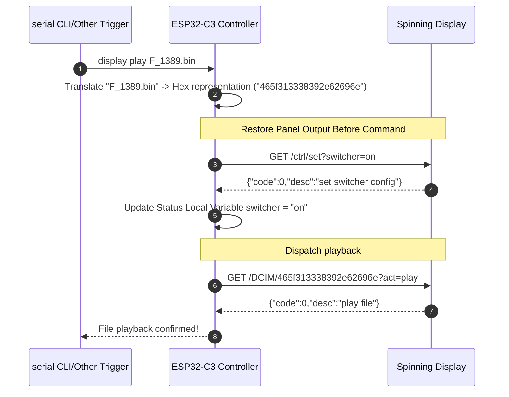
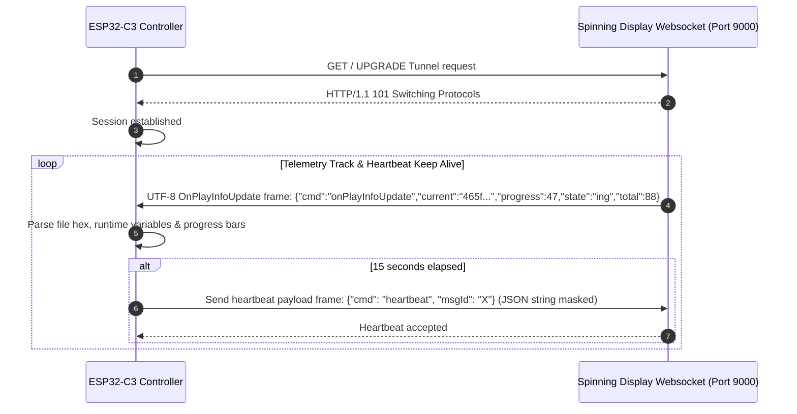

# Spinning Display Physical AP & Controller Protocol Specification

This document details the hardware communication protocol, connection sequences, message frames, and HTTP / WebSocket APIs used to coordinate the spinning display platform using the ESP32-C3 microcontroller.

An OpenAPI 3.0 descriptor specifies all Port 80 endpoints inside [docs/display-openapi.yaml](docs/display-openapi.yaml).

---

## 1. Network Layer

- **IP Interface Configuration**:
  - The Spinning Display activates a local AP starting with SSID `5D_` (e.g. `5D_0F1D`).
  - **AP IP Location**: `192.168.4.1`
  - **ESP32 Client IP Location**: assigned by DHCP, usually `192.168.4.2`
  - **Security Type**: WPA3 Personal
  - **Connection Password**: <see manual>

---

## 2. Startup Provisioning Sequence

The system maintains real-time keep-alive TCP and WebSocket sockets concurrently. The power-on setup sequence is designed to boot cleanly and fast, blanking the display instantly using the `switcher` configuration before loading the directory context.

### Bootstrap Process Flow



---

## 3. Playback Control Flow

Because the `switcher` parameter is initialized to `off`, raw file playback requests are ignored if the display state isn't restored. The device handles this state boundary internally before committing a file start command.



---

## 4. WebSocket Telemetry & Heartbeat Protocol

Telemetry is managed via Port 9000, streaming active tracking updates frame-by-frame. The client keeps the WebSocket channel alive by providing a ping heartbeat every 15 seconds.

### Heartbeat Sequence



---

## 5. Message Syntax References

### 5.1 Dynamic Config Variable List
A query of `/ctrl/get?k=all` returns array elements in key/value blocks. To parsed nested objects safely (like `ssid` value below containing backslash escapes), the custom parser handles the stream statefully.

```json
{
  "code": 0,
  "desc": "get all config",
  "data": [
    {
      "code": 0,
      "desc": "brightness config",
      "key": "brightness",
      "type": 0,
      "ro": 0,
      "value": 3,
      "min": 1,
      "max": 3,
      "step": 1
    },
    {
      "code": 0,
      "desc": "angle config",
      "key": "angle",
      "type": 0,
      "ro": 0,
      "value": 139,
      "min": 0,
      "max": 360,
      "step": 3
    },
    {
      "code": 0,
      "desc": "volum config",
      "key": "volum",
      "type": 0,
      "ro": 0,
      "value": 3,
      "min": 1,
      "max": 3,
      "step": 1
    },
    {
      "code": 0,
      "desc": "ble config",
      "key": "ble",
      "type": 1,
      "ro": 0,
      "value": "on",
      "opts": ["on", "off"]
    },
    {
      "code": 0,
      "desc": "ssid config",
      "key": "ssid",
      "type": 2,
      "ro": 0,
      "value": "{\"\":\"\"}"
    },
    {
      "code": 0,
      "desc": "switcher config",
      "key": "switcher",
      "type": 1,
      "ro": 0,
      "value": "on",
      "opts": ["on", "off"]
    },
    {
      "code": 0,
      "desc": "loop config",
      "key": "loop",
      "type": 1,
      "ro": 0,
      "value": "all",
      "opts": ["one", "all"]
    }
  ]
}
```

### 5.2 Device Metadata Endpoint
The metadata call `/info` delivers static metrics about model design:

```json
{
    "code": 0,
    "desc": "device info",
    "model": "F-MINI12",
    "sw": "1.1.0"
}
```
